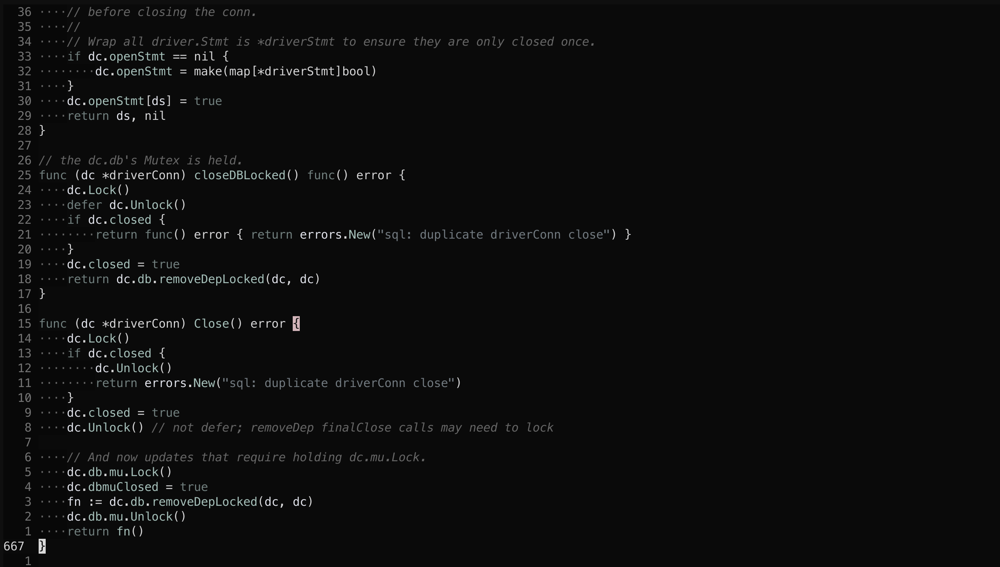

> [!NOTE]
> This is a backup of [masar3141/mono-jade](https://github.com/masar3141/mono-jade).

Install with a package manager:
```lua
{"vunhatchuong/mono-jade"}

vim.cmd("color mono-jade")
```

# Screenshot

